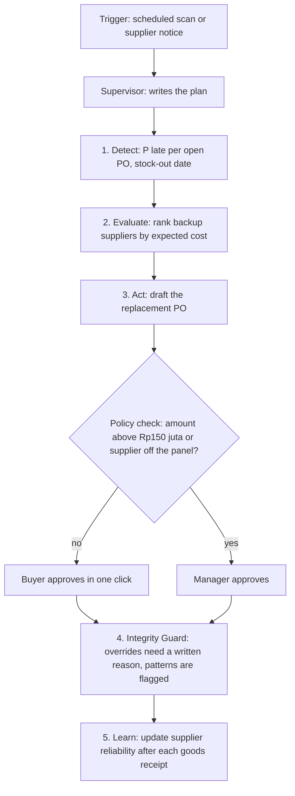

# GESIT

Multi-agent procurement disruption assistant for the Agentic AI Hackathon 2026
(Track A: Intelligent Supply Chain, final demo 31 October 2026).

An F&B manufacturer buys sugar from a panel of approved suppliers. When the
main supplier is late, raises its price or runs short of capacity, the line
can stop within days. GESIT predicts which open purchase orders (POs) are at
risk, ranks backup suppliers by expected total cost, drafts the replacement PO
under policy guardrails, and flags suspicious buyer and supplier patterns.

All procurement data in this repository is **simulated**. Only the price anchor
(PIHPS, Bank Indonesia) is real.

> **Project status:** work in progress. [WORKING.md](WORKING.md) shows what is
> built, what is next and which folders exist today.

## How GESIT works



| Step | What happens | Requirements in the PRD |
|---|---|---|
| Detect | SAP-RPT gives P(late) for every open PO. A PO is flagged on high risk, a delay notice, a price increase above 3% or a capacity shortfall | FR-DET |
| Evaluate | Deterministic Python scores each backup supplier: price plus the expected cost of a stock-out. The LLM only explains the numbers, it never computes them | FR-SEL |
| Act | The agent drafts the PO. Release is denied by policy above Rp150 juta or for an off-panel supplier, and goes to a manager | FR-ACT, POL-1 to POL-4 |
| Integrity Guard | Choosing a supplier other than the top one needs a written justification. Unusual buyer and supplier patterns are flagged for the manager, never blocked | FR-INT |
| Learn | Supplier reliability is updated after each goods receipt, and a Monte Carlo simulation compares GESIT with "always cheapest" and "always fastest" | FR-EVA |

The stack: Strands agents on Amazon Bedrock AgentCore (Runtime, Gateway,
Policy, Memory, Observability), SAP-RPT on SAP AI Core for prediction, SAP Gen
AI Hub for masked explanations, Streamlit for the UI. The architecture diagram
is in [PRD.md, section 5](PRD.md#5-architecture).

## What to read, in order

| # | File | Read it for | Time |
|---|---|---|---|
| 1 | This README | The idea and the flow | 3 min |
| 2 | [PRD.md](PRD.md) | The full picture: problem, goals, architecture, every requirement (FR, POL, NFR, D rules), demo script, milestones, open decisions. This is the source of truth | 20 min |
| 3 | [WORKING.md](WORKING.md) | Where the project stands today: status per PRD section, next steps, log of finished work | 3 min |
| 4 | [data_gen/README.md](data_gen/README.md) | How the synthetic dataset is built, what is real and what is assumed, how to regenerate it | 10 min |
| 5 | [docs/data_dictionary.md](docs/data_dictionary.md) | Every CSV file and column, and which files the agent may read | reference |
| 6 | [data_gen/out/validation_report.md](data_gen/out/validation_report.md) | Checks on the simulated data (price correlation, planted patterns, baseline model scores) | 5 min |
| 7 | [CLAUDE.md](CLAUDE.md) | Working and code rules for contributors and for AI coding sessions | 3 min |

Short on time: read 1, then sections 1, 2, 5 and 12 of the PRD, then 3.

## Repository map

The target layout is in [PRD.md, section 13](PRD.md#13-proposed-repository-layout).
Folders are added as they are built.

| Path | Content |
|---|---|
| `data_gen/` | Synthetic data generator, its PIHPS price input (`data/pihps/`) and its output (`out/`) |
| `docs/` | Data dictionary; later the assumptions page, architecture diagram and Q&A prep |
| `tests/` | Tests and an offline fake PIHPS file maker |
| `adapters/`, `scoring/`, `tools/`, `agents/` | S/4-shaped data access, expected-cost scoring, MCP tools, Strands supervisor and sub-agents |
| `integrations/sap/`, `policy/`, `eval/` | SAP-RPT and Gen AI Hub clients, Cedar policies, Monte Carlo and model benchmarks |
| `ui/`, `infra/`, `scripts/` | Streamlit app, AWS setup, demo reset and data load |

One rule worth knowing before reading the code: `data_gen/out/_truth/` holds
the hidden parameters of the simulated world. Only `eval/` may read it; agents,
tools and the UI never do (rule D-1).

## Quick start

Regenerate and validate the dataset (Python 3.11+):

```bash
pip install -r requirements.txt
cd data_gen && python generate.py && python validate.py
```
On Windows use `py -3.11` instead of `python`. The same seed and PIHPS file
give byte-identical output. Details are in [data_gen/README.md](data_gen/README.md).

## Contributing

- Find the requirement IDs your task touches in [PRD.md](PRD.md) and mention them in code comments and the commit message.
- If a requirement changes, update PRD.md and its Changelog in the same change.
- After finishing a task, update [WORKING.md](WORKING.md).
- Feature freeze is 25 October 2026.
